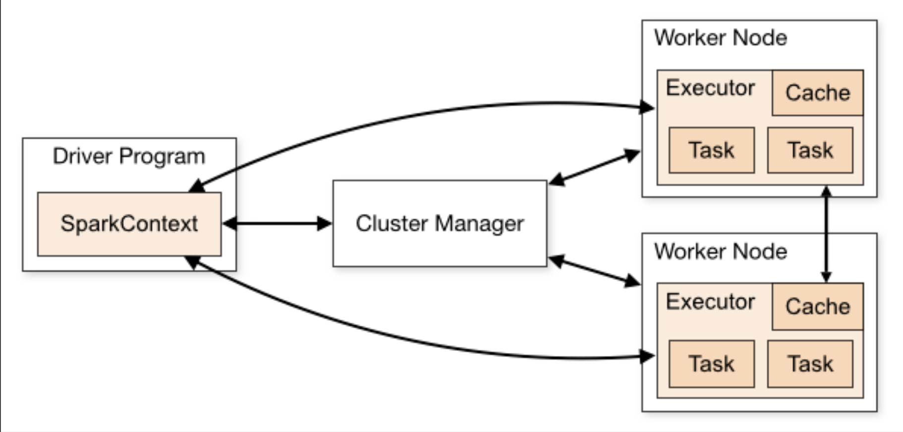

# Comparative Study of Yelp data-analysis using Pyspark and Python distributed processes

Any sector that caters to the needs of customers is bound to receive reviews and rating. Therefore, interpretation of these rating or reviews play a vital role. So, a [Yelp dataset](https://www.kaggle.com/datasets/yelp-dataset/yelp-dataset) is employed to analyse this. This is a subset of Yelp’s businesses, reviews, and user information. This dataset contains information about firms in eight metropolitan areas in the United States and Canada. This dataset contains five JSON files namely such as business, review, user, tip and checkin. 

This project aims to use the pyspark distributed system to analyze various data insights across all business elements by running some queries or usecases utilizing the same data system followed by a comparative study of **Pyspark programming** with python based distributed programming methodologies such **MPI, multiprocessing, multithreading, and Pandas serial execution**.

## Directory Structure

```
├── data/                               <- Sample data for the project
├── python-analysis/                    <- Queries employed using Python based distrubuted programming methodologies
│  ├── MPI/                             <- Python scripts for queries executed using Message Passing Interface
│  ├── multi-processing/                <- Python scripts for queries executed using multi-processing techniques
|  ├── multi-threading/                 <- Python scripts for queries executed using multi-threading techniques
|  ├── pandas/                          <- Python scripts for queries executed using Pandas serial execution
├── pyspark-analysis/                   <- Queries employed using Pyspark 
│  ├── example_queries.ipynb/           <- Example Pyspark notebook for queries 
│  ├── sample_pyspark_anaysis.ipynb/    <- Pyspark execution on sample dataset
│  ├── fullData_pyspark_analysis/       <- Pyspark execution on the complete dataset
├── .gitignore                          <- List of files and folders git should ignored
├── LICENSE                             <- Project's License    
└── README.md                           <- The top-level README for developers using this project
```

## Spark Architecture

- Apache Spark Architecture is an open-source framework-based component that are used to process a large amount of unstructured, semi-structured and structured data for analytics. Spark Architecture is considered as an alternative to Hadoop and map-reduce architecture for big data processing. Spark architecture associated with Resilient Distributed Datasets(RDD) and Directed Acyclic Graph (DAG) for data storage and processing. Also, It has four components that are part of the architecture such as spark driver, Executors, Cluster managers, Worker Nodes.



- Spark considers the master/worker process in the architecture and all the task works on the top of the Hadoop distributed file system. Apache spark makes use of Hadoop for data processing and data storage processes. They are considered to be in-memory data processing engine and makes their applications run on Hadoop clusters faster than a memory. Having in-memory processing prevents the failure of disk I/O.

## Comparitive Study

As spark allows the heterogeneous job to work with the same data so it divides its data into partitions, the size of the split partitions depends on the given data source gifting it the ability to compute things faster. Spark also allows the user to cache the data in memory, which is a great feature for iterative algorithms. Spark also allows the user to cache the data in memory, which is a great feature for iterative algorithms. 

|   Queries   | Pyspark  |    MPI     |  Multi-processing | Multi-threading | Pandas Serial Exec |
|-------------|----------|------------|-------------------|-----------------|--------------------|
| Query No 1  | `7.8s`   |   `12.4s`  |      `13.3s`      |    `29.9s`      |     `27.4s`        |
| Query No 2  | `6.3s`   |   `7.9s`   |      `9.2s`       |    `17.9s`      |     `13.1s`        |
| Query No 3  | `6.7s`   |   `7.9s`   |      `9.7s`       |    `17.8s`      |     `14.9s`        |
| Query No 4  | `6.1s`   |   `8.1s`   |      `9.4s`       |    `19s`        |     `14.9s`        |

- It can be deduced that Spark programming demonstrates superior efficiency compared to other programming methodologies in the realm of distributed computing. Both MPI and Multiprocessing exhibited similar performance, although MPI generally outperforms the multiprocessing module in Python due to its implementation in C and its tailored design for parallel computing environments. MPI also offers a comprehensive set of features for effective inter-process communication.
  
- On the other hand, multithreading showed comparatively poorer performance than the other methods. However, it should be noted that multithreading remains a viable option for CPU-bound execution followed by Pandas serial execution which was the slowest of all the methods, which is expected since it is a single-threaded library.